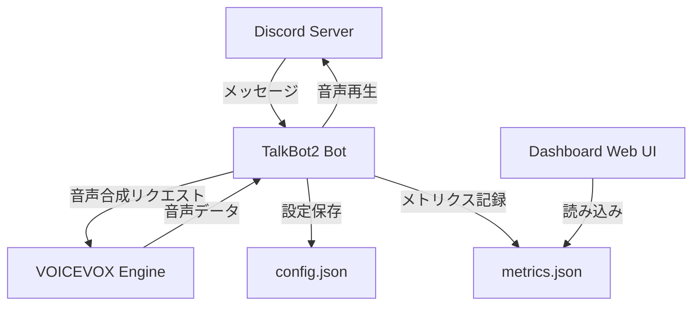

# Documentation Skill

このスキルは、TalkBot2プロジェクトにおけるドキュメント作成・更新のガイドラインとベストプラクティスを提供します。

## スキルの対象

- **対象ファイル**: `README.md`, `docs/**/*.md`, `*.md`
- **対象タスク**: ドキュメント作成、更新、構造化、例示
- **前提知識**: Markdown記法、プロジェクト構造、機能要件

---

## ドキュメント作成原則

### 1. ユーザー視点で書く

**ターゲットユーザー**:
- Discord Botを初めて使う人
- 環境構築をする開発者
- 機能をカスタマイズしたい人

**✅ 推奨**:
```markdown
## セットアップ

1. このリポジトリをクローン:
   ```bash
   git clone https://github.com/syuutaMC/TalkBot2.git
   cd TalkBot2
   ```

2. 環境変数を設定:
   `.env.example`を`.env`にコピーし、Discord Botトークンを記入
```

**❌ 避ける**:
```markdown
## セットアップ
環境変数を設定してください。
```

### 2. README.md の構造

TalkBot2プロジェクトのREADME.mdは以下の構造を維持する：

```markdown
# TalkBot2

## 概要
- 何をするBotか（短く、1-2文）
- 主な機能のリスト

## 機能
- スラッシュコマンド一覧（表形式）
- 辞書機能
- 音声速度設定
- メトリクス・ダッシュボード

## セットアップ

### 前提条件
- Python 3.9以上
- Discord Bot Token
- VOICEVOX Engine

### インストール手順
1. クローン
2. 依存関係のインストール
3. 環境変数設定
4. 起動

## Docker での起動

## 使い方
- Botをサーバーに招待する方法
- 基本的なコマンド使用例

## 開発者向け情報
- プロジェクト構造
- テストの実行方法
- コントリビューションガイド

## トラブルシューティング
- よくある問題と解決方法

## ライセンス
```

### 3. コマンド・API のドキュメント

**スラッシュコマンドのドキュメント**（README.mdに記載）:

```markdown
## スラッシュコマンド一覧

| コマンド | 説明 | 引数 | 例 |
|---------|------|------|-----|
| `/join` | ボイスチャンネルに参加 | - | `/join` |
| `/leave` | ボイスチャンネルから退出 | - | `/leave` |
| `/voice <speaker>` | 話者を変更 | speaker: 話者名 | `/voice ずんだもん` |
| `/speed <value>` | 読み上げ速度を設定 | value: 0.5〜2.0 | `/speed 1.5` |
| `/dict add <word> <reading>` | 辞書に単語を追加 | word: 単語, reading: 読み方 | `/dict add Discord でぃすこーど` |
```

**API仕様（docstring）の書き方**:

```python
async def create_audio(self, text: str, speaker_id: int = 1, speed: float = 1.0) -> Optional[bytes]:
    """
    テキストから音声データを生成する
    
    Args:
        text (str): 読み上げるテキスト
        speaker_id (int, optional): VOICEVOX話者ID. デフォルトは1.
        speed (float, optional): 読み上げ速度（0.5〜2.0）. デフォルトは1.0.
    
    Returns:
        Optional[bytes]: 生成された音声データ（WAV形式）。失敗時はNone.
    
    Raises:
        aiohttp.ClientError: VOICEVOX Engineへの接続に失敗した場合
        asyncio.TimeoutError: タイムアウトした場合
    
    Example:
        ```python
        client = VoicevoxClient()
        await client.initialize()
        audio = await client.create_audio("こんにちは", speaker_id=3, speed=1.2)
        ```
    """
    pass
```

### 4. セットアップガイドの詳細度

**環境変数の説明は必ず具体例を含める**:

```markdown
## 環境変数

`.env`ファイルを作成し、以下の変数を設定してください：

| 変数名 | 説明 | 必須 | デフォルト値 | 例 |
|--------|------|------|-------------|-----|
| `DISCORD_TOKEN` | Discord BotのトークンをDiscord Developer Portalから取得 | ✅ | - | `MTIzNDU2Nzg5MDEyMzQ1Njc4OQ.GhIjKl.MnOpQrStUvWxYzAbCdEfGhIjKlMnOpQrSt` |
| `VOICEVOX_URL` | VOICEVOX EngineのエンドポイントURL | ❌ | `http://127.0.0.1:50021` | `http://localhost:50021` |
| `DISCORD_GUILD_ID` | テスト用のギルドID（即座にコマンドを同期） | ❌ | - | `123456789012345678` |
```

### 5. トラブルシューティングセクション

**問題と解決策のペアで記載**:

```markdown
## トラブルシューティング

### Botが起動しない

**症状**: `discord.errors.LoginFailure: Improper token has been passed.`

**原因**: Discord Botトークンが無効または設定されていない。

**解決方法**:
1. `.env`ファイルに`DISCORD_TOKEN`が正しく設定されているか確認
2. Discord Developer Portalで新しいトークンを再生成
3. トークンの前後に余分なスペースや引用符がないか確認

### 音声が再生されない

**症状**: Botはボイスチャンネルに参加するが音声が聞こえない。

**原因**: VOICEVOX Engineが起動していない、または接続できない。

**解決方法**:
1. VOICEVOX Engineが起動しているか確認: `http://127.0.0.1:50021/docs` にアクセス
2. Docker Composeを使用している場合、`docker-compose ps`で全サービスが起動しているか確認
3. ファイアウォールでポート50021がブロックされていないか確認
```

### 6. コード例の提供

**実際に動作する完全な例を提供**:

```markdown
## 使い方

### 基本的な読み上げ

1. Botをボイスチャンネルに招待:
   ```
   /join
   ```

2. テキストチャンネルにメッセージを送信すると自動的に読み上げられます:
   ```
   こんにちは！これはテストです。
   ```

3. 話者を変更:
   ```
   /voice ずんだもん
   ```

4. 読み上げ速度を変更:
   ```
   /speed 1.5
   ```

### 辞書機能の使い方

特定の単語の読み方を登録できます:

```
/dict add Discord でぃすこーど
/dict add Python ぱいそん
```

登録した単語を含むメッセージは、指定した読み方で読み上げられます。

辞書の一覧を確認:
```
/dict list
```

単語を削除:
```
/dict remove Discord
```
```

### 7. 図・構成図の活用

**Mermaid記法を使用して図を作成**:

```markdown
## アーキテクチャ


\```

### 8. 更新時のルール

**ドキュメント更新のチェックリスト**:

- [ ] 新機能を追加した場合、README.mdの「機能」セクションを更新
- [ ] 新しいコマンドを追加した場合、「スラッシュコマンド一覧」テーブルを更新
- [ ] 新しい環境変数を追加した場合、「環境変数」セクションと`.env.example`を更新
- [ ] 依存関係が変わった場合、セットアップ手順を確認・更新
- [ ] 既知の問題が解決した場合、トラブルシューティングセクションを更新
- [ ] APIの仕様が変わった場合、該当する関数のdocstringを更新

### 9. バージョン情報の管理

**CHANGELOG.md の推奨構造**:

```markdown
# Changelog

## [Unreleased]
### Added
- 新機能の説明

### Changed
- 変更内容

### Fixed
- バグ修正

## [1.2.0] - 2026-03-29
### Added
- 辞書機能（単語の読み方カスタマイズ）
- メトリクスダッシュボード

### Changed
- 話者選択UIをドロップダウンからオートコンプリートに変更

### Fixed
- ボイスチャンネル切断時のクリーンアップ処理
```

---

## Copilot への指示

### ドキュメント作成時

**新機能を追加した場合**:
1. README.mdの該当セクション（機能、コマンド一覧）を更新
2. 使い方の例を追加
3. 環境変数が追加されている場合は説明を追加
4. docstringを完全に記述

**バグ修正をした場合**:
1. トラブルシューティングセクションに該当する問題があれば更新
2. 修正内容をCHANGELOG.mdに記録（存在する場合）

**APIを変更した場合**:
1. 関数のdocstringを更新
2. 使い方のコード例を修正
3. 互換性のない変更の場合は、移行ガイドを追加

### ドキュメントレビュー時の確認項目

- [ ] 全てのコマンドが文書化されているか
- [ ] コード例が実際に動作するか
- [ ] 専門用語に説明があるか
- [ ] リンク切れがないか
- [ ] スクリーンショットやコード例が古くないか
- [ ] セットアップ手順が最新か
- [ ] 環境変数の説明が完全か

---

## TalkBot2固有のドキュメント規則

### 用語の統一

| 用語 | 説明 | 使用例 |
|------|------|--------|
| **ボイスチャンネル** | Discordの音声チャンネル | ✅ "ボイスチャンネルに参加" |
| **テキストチャンネル** | Discordのテキストチャンネル | ✅ "テキストチャンネルでコマンドを実行" |
| **話者** | VOICEVOX の音声キャラクター | ✅ "話者を変更する" |
| **読み上げ** | テキストを音声に変換して再生 | ✅ "メッセージを読み上げる" |
| **辞書** | カスタム読み方の登録機能 | ✅ "辞書に単語を追加" |

### コマンド表記

- スラッシュコマンドは必ず `/` を含める: ✅ `/join` ❌ `join`
- 引数は `<必須>` と `[オプション]` で区別
- 例: `/voice <speaker>`, `/join [channel]`

### ファイルパスの表記

- プロジェクトルートからの相対パス: `src/bot.py`, `config/config.json`
- 環境変数ファイルは明示的に: `.env`, `.env.example`

---

**このスキルを使用することで、プロジェクトのドキュメントが常に最新で分かりやすく保たれます。**
