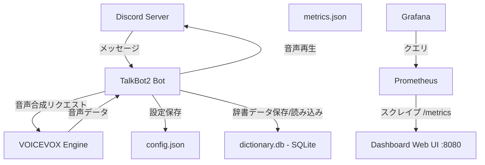

# TalkBot2

VOICEVOX Engineを使用してDiscordのテキストチャンネルのメッセージを読み上げるBotです。

## 概要

TalkBot2は、DiscordサーバーでVOICEVOX Engineを使用した高品質な音声合成でテキストメッセージを読み上げるBotです。
ユーザーごとに異なる話者（キャラクター）を設定でき、読み上げ速度の調整や単語の読み方をカスタマイズできる辞書機能を備えています。

### 主な機能

- ✅ スラッシュコマンド対応
- ✅ VOICEVOXによる高品質な音声合成
- ✅ ユーザーごとに異なる音声キャラクター設定
- ✅ 読み上げ速度の調整
- ✅ 複数の話者（キャラクター）から選択可能
- ✅ **辞書機能** - 特定の単語の読み方をカスタマイズ
- ✅ **メトリクス・ダッシュボード** - パフォーマンスとエラーの可視化
- ✅ **Prometheus exporter** - `/metrics` エンドポイントで Grafana 等と連携可能

## スラッシュコマンド一覧

| コマンド | 説明 | 引数 | 例 |
|---------|------|------|-----|
| `/join` | ボイスチャンネルに参加し、読み上げを開始 | - | `/join` |
| `/leave` | ボイスチャンネルから退出 | - | `/leave` |
| `/help` | 使い方とコマンド一覧を表示 | - | `/help` |
| `/voice <speaker_id>` | 自分の読み上げ音声を変更 | speaker_id: 話者ID（数値） | `/voice 3` |
| `/speakers` | 利用可能な話者（キャラクター）一覧を表示 | - | `/speakers` |
| `/speed <value>` | 読み上げ速度を設定 | value: 速度（0.5〜2.0） | `/speed 1.5` |
| `/dictionary add <before> <after>` | 辞書に変換ルールを追加 | before: 変換前テキスト, after: 変換後テキスト | `/dictionary add Discord でぃすこーど` |
| `/dictionary remove <before>` | 辞書から変換ルールを削除 | before: 変換前テキスト | `/dictionary remove Discord` |
| `/dictionary list` | 辞書に登録されている変換ルール一覧を表示 | - | `/dictionary list` |

## プロジェクト構造

```
TalkBot2/
├── .github/              # Copilot設定・スキル定義
│   ├── copilot-instructions.md
│   └── skills/          # カスタムスキル
├── src/                 # ソースコード
│   ├── bot.py          # メインBot（コマンド・イベント・辞書・音声キュー）
│   ├── voicevox_client.py  # VOICEVOX連携
│   ├── prometheus_exporter.py  # Prometheus exporter（/metrics エンドポイント）
│   ├── dictionary_db.py    # SQLite辞書データベース管理
│   ├── dashboard.py    # 監視ダッシュボード（aiohttp Webサーバー）
│   └── templates/      # ダッシュボードテンプレート
│       └── index.html
├── tests/              # テストコード
├── docker/             # Docker設定
│   ├── Dockerfile            # Bot用
│   ├── Dockerfile.dashboard  # ダッシュボード用
│   └── docker-compose.yml    # 3サービス構成（voicevox, bot, dashboard）
├── config/             # 設定ファイル（config.json）
├── run.py              # 起動スクリプト
├── requirements.txt    # Python依存パッケージ
└── README.md           # このファイル
```

## アーキテクチャ



## セットアップ

### 前提条件

#### Dockerを使う場合（推奨）
- Docker
- Docker Compose
- **NVIDIA GPU（推奨）** - GPU版VOICEVOX Engineを使用
- NVIDIA Container Toolkit（GPU使用時）
- Discord Bot Token

#### 直接起動する場合
- Python 3.9以上
- Discord Bot Token
- VOICEVOX Engine（ローカルで起動）
- FFmpeg（音声再生に必要）

### 1. VOICEVOX Engineのインストール

#### Dockerを使う場合（GPU対応）
Docker Composeを使用する場合、VOICEVOX EngineのGPU版が自動的に起動します。
NVIDIA GPUを使用するには、[NVIDIA Container Toolkit](https://docs.nvidia.com/datacenter/cloud-native/container-toolkit/install-guide.html)のインストールが必要です。

#### 直接起動する場合
[VOICEVOX公式サイト](https://voicevox.hiroshiba.jp/)からVOICEVOX Engineをダウンロードして起動してください。

デフォルトでは `http://127.0.0.1:50021` で起動します。

### 2. FFmpegのインストール

#### Windows
1. [FFmpeg公式サイト](https://ffmpeg.org/download.html)からダウンロード
2. zipを解凍し、`bin`フォルダのパスを環境変数に追加

#### Mac
```bash
brew install ffmpeg
```

#### Linux
```bash
sudo apt install ffmpeg
```

### 3. Discord Botの作成

1. [Discord Developer Portal](https://discord.com/developers/applications)にアクセス
2. 「New Application」をクリックしてアプリケーションを作成
3. 「Bot」タブで「Add Bot」をクリック
4. 「TOKEN」をコピーして保存
5. 「Privileged Gateway Intents」で以下を有効化：
   - MESSAGE CONTENT INTENT
   - SERVER MEMBERS INTENT
6. 「OAuth2」→「URL Generator」で以下を選択：
   - SCOPES: `bot`, `applications.commands`
   - BOT PERMISSIONS: 
     - Send Messages
     - Connect
     - Speak
     - Use Voice Activity
7. 生成されたURLでBotをサーバーに招待

### 4. プロジェクトのセットアップ

```bash
# リポジトリのクローン
git clone https://github.com/syuutaMC/TalkBot2.git
cd TalkBot2

# 仮想環境の作成（推奨）
python -m venv venv

# 仮想環境の有効化
# Windows:
venv\Scripts\activate
# Mac/Linux:
source venv/bin/activate

# 依存パッケージのインストール
pip install -r requirements.txt
```

### 5. 環境変数の設定

`.env.example`をコピーして`.env`ファイルを作成し、設定を記入してください。

```bash
# Windowsの場合
copy .env.example .env

# Mac/Linuxの場合
cp .env.example .env
```

`.env`ファイルを編集：

| 変数名 | 説明 | 必須 | デフォルト値 | 例 |
|--------|------|------|-------------|-----|
| `DISCORD_TOKEN` | Discord BotのトークンをDiscord Developer Portalから取得 | ✅ | - | `MTIzNDU2Nzg5MDEyMzQ1Njc4OQ.GhIjKl...` |
| `VOICEVOX_URL` | VOICEVOX EngineのエンドポイントURL | ❌ | `http://127.0.0.1:50021` | `http://localhost:50021` |
| `DISCORD_GUILD_ID` | テスト用のギルドID（設定するとそのギルドにのみコマンドを即座に同期） | ❌ | - | `123456789012345678` |

## 起動方法

### Dockerを使う場合（推奨）

Dockerを使えばGPU対応のVOICEVOX EngineとBotを一緒に簡単に起動できます。

**注意**: NVIDIA GPUを使用する場合は、事前に[NVIDIA Container Toolkit](https://docs.nvidia.com/datacenter/cloud-native/container-toolkit/install-guide.html)をインストールしてください。

```bash
# .envファイルを作成（DISCORD_TOKENを設定）
copy .env.example .env  # Windowsの場合
# または
cp .env.example .env    # Mac/Linuxの場合

# Docker Composeで起動（dockerフォルダから実行）
cd docker
docker-compose up -d

# ログの確認
docker-compose logs -f discord-bot

# ダッシュボードにアクセス
# ブラウザで http://localhost:8080 を開く

# 停止
docker-compose down
cd ..
```

起動時に以下のメッセージが表示されればOKです：
```
✓ VOICEVOX Engineに接続しました
✓ スラッシュコマンドを同期しました
✓ BotName としてログインしました
```

### 直接起動する場合

```bash
# 方法1: run.pyを使用（推奨）
python run.py

# 方法2: 直接指定
python src/bot.py

# 方法3: モジュールとして実行
python -m src.bot
```

起動後、ダッシュボードは `http://localhost:8080` で閲覧できます。

## 使い方

### Botをサーバーに招待

1. [Discord Developer Portal](https://discord.com/developers/applications)で作成したアプリケーションを選択
2. 「OAuth2」→「URL Generator」で以下を選択：
   - **SCOPES**: `bot`, `applications.commands`
   - **BOT PERMISSIONS**: 
     - Send Messages
     - Connect
     - Speak
     - Use Voice Activity
3. 生成されたURLでBotをサーバーに招待

### 基本的な読み上げ

1. Botをボイスチャンネルに招待:
   ```
   /join
   ```

2. テキストチャンネルにメッセージを送信すると自動的に読み上げられます:
   ```
   こんにちは！これはテストです。
   ```

3. 話者を変更:
   ```
   /speakers
   ```
   利用可能な話者一覧を確認し、好きな話者のIDを指定:
   ```
   /voice 3
   ```

4. 読み上げ速度を変更:
   ```
   /speed 1.5
   ```

5. 退出:
   ```
   /leave
   ```

### 辞書機能の使い方

特定の単語の読み方を登録できます:

```
/dictionary add Discord でぃすこーど
/dictionary add Python ぱいそん
/dictionary add GitHub ぎっとはぶ
```

登録した単語を含むメッセージは、指定した読み方で読み上げられます。

辞書の一覧を確認:
```
/dictionary list
```

単語を削除:
```
/dictionary remove Discord
```

### メトリクス・ダッシュボード

Bot起動時に、パフォーマンスとエラーを可視化するダッシュボードが `http://localhost:8080` で起動します（Docker使用時はdashboardコンテナから提供）。

ダッシュボードで確認できる情報:
- 音声合成のレイテンシ（応答時間）
- エラー発生回数
- コマンド使用回数
- 過去30日間の統計データ

### Prometheus exporter

ダッシュボードの `/metrics` エンドポイントで、Prometheus 形式のメトリクスを公開しています。
Prometheus + Grafana などの外部監視ツールと連携してアラートや長期的な可視化が可能です。

```
http://localhost:8080/metrics
```

公開されるメトリクス一覧:

| メトリクス名 | 種類 | 説明 |
|---|---|---|
| `talkbot_messages_total` | Counter | 受信メッセージ数 |
| `talkbot_commands_total{command}` | Counter | スラッシュコマンド実行数（コマンド名ラベル付き） |
| `talkbot_voice_play_total` | Counter | 音声再生回数 |
| `talkbot_errors_total` | Counter | Bot 内部エラー数 |
| `talkbot_voicevox_requests_total` | Counter | VOICEVOX API 呼び出し回数 |
| `talkbot_voicevox_latency_seconds` | Histogram | VOICEVOX 音声生成レイテンシ（秒） |
| `talkbot_voicevox_errors_total` | Counter | VOICEVOX API エラー数 |
| `talkbot_uptime_seconds` | Gauge | Bot プロセスの稼働時間（秒） |
| `talkbot_memory_usage_bytes` | Gauge | Bot プロセスのメモリ使用量（バイト） |

Prometheus の設定例 (`prometheus.yml`):

```yaml
scrape_configs:
  - job_name: talkbot2
    static_configs:
      - targets: ['localhost:8080']
```

## Docker関連のコマンド

```bash
# dockerフォルダに移動
cd docker

# コンテナの起動
docker-compose up -d

# ログの確認
docker-compose logs -f

# Botのみのログ
docker-compose logs -f discord-bot

# VOICEVOX Engineのみのログ
docker-compose logs -f voicevox

# コンテナの再起動
docker-compose restart

# コンテナの停止
docker-compose down

# イメージの再ビルド
docker-compose build --no-cache

# コンテナの状態確認
docker-compose ps

# プロジェクトルートに戻る
cd ..
```

## トラブルシューティング

### Botが起動しない

**症状**: `discord.errors.LoginFailure: Improper token has been passed.`

**原因**: Discord Botトークンが無効または設定されていない。

**解決方法**:
1. `.env`ファイルに`DISCORD_TOKEN`が正しく設定されているか確認
2. Discord Developer Portalで新しいトークンを再生成
3. トークンの前後に余分なスペースや引用符がないか確認

### 音声が再生されない

**症状**: Botはボイスチャンネルに参加するが音声が聞こえない。

**原因**: VOICEVOX Engineが起動していない、または接続できない。

**解決方法**:
1. VOICEVOX Engineが起動しているか確認: `http://127.0.0.1:50021/docs` にアクセス
2. Docker Composeを使用している場合、`docker-compose ps`で全サービスが起動しているか確認
3. ファイアウォールでポート50021がブロックされていないか確認
4. `.env`ファイルの`VOICEVOX_URL`が正しいか確認

### Docker使用時にコンテナが起動しない

**症状**: `docker-compose up -d`実行後もコンテナが起動しない。

**原因**: メモリ不足、ポート競合、Dockerデーモン未起動など。

**解決方法**:
```bash
# ログを確認
docker-compose logs

# コンテナを再ビルド
docker-compose down
docker-compose build --no-cache
docker-compose up -d
```

### VOICEVOX Engine（Docker）が起動しない

**原因と解決方法**:
- **メモリ不足**: 最低4GB推奨。Docker Desktopのリソース設定を確認
- **GPU版が起動しない**: 
  - NVIDIA Container Toolkitがインストールされているか確認: `nvidia-smi`
  - GPUが使用できない場合は、CPU版に切り替え:
    ```yaml
    # docker-compose.ymlのvoicevoxイメージを変更
    image: voicevox/voicevox_engine:cpu-ubuntu20.04-latest
    ```

### FFmpegがインストールされていない

**症状**: 音声再生時にエラーが発生する。

**解決方法**:

#### Windows
1. [FFmpeg公式サイト](https://ffmpeg.org/download.html)からダウンロード
2. zipを解凍し、`bin`フォルダのパスを環境変数に追加
3. コマンドプロンプトで `ffmpeg -version` を実行して確認

#### Mac
```bash
brew install ffmpeg
```

#### Linux
```bash
sudo apt install ffmpeg
```

### Botがボイスチャンネルに参加できない

**症状**: `/join`コマンドを実行してもBotが参加しない。

**原因**: Bot招待時に必要な権限が付与されていない。

**解決方法**:
1. Bot招待時に以下の権限を付与したか確認：
   - Connect（接続）
   - Speak（発言）
   - Use Voice Activity（音声検出を使用）
2. サーバーの該当チャンネルの権限設定でBotがブロックされていないか確認

### ダッシュボードにアクセスできない

**症状**: `http://localhost:8080`にアクセスできない。

**解決方法**:
1. Bot起動ログでダッシュボードが起動しているか確認
2. ポート8080が他のアプリケーションで使用されていないか確認:
   ```bash
   # Windows
   netstat -ano | findstr :8080
   
   # Mac/Linux
   lsof -i :8080
   ```
3. 環境変数`DASHBOARD_PORT`でポート番号を変更可能

## 開発者向け情報

### テストの実行

```bash
# 全テストを実行
pytest

# 特定のファイルをテスト
pytest tests/test_bot.py

# カバレッジを確認
pytest --cov=src tests/
```

### プロジェクト構成の詳細

- `src/bot.py`: メインBot（コマンド、イベントハンドラ、辞書機能、音声キュー管理）
- `src/voicevox_client.py`: VOICEVOX Engine連携クライアント
- `src/prometheus_exporter.py`: Prometheus exporter（`/metrics` エンドポイント・全メトリクス定義・`get_snapshot()` でダッシュボード向け JSON 提供）
- `src/dashboard.py`: aiohttp Webサーバー（メトリクス可視化ダッシュボード・`/metrics` ルート）
- `src/dictionary_db.py`: SQLite辞書データベース管理（ギルドごとの読み方登録）
- `src/metrics.py`: メトリクス収集・管理（レイテンシ、エラー、コマンド使用回数）
- `src/dashboard.py`: aiohttp Webサーバー（メトリクス可視化ダッシュボード）
- `config/config.json`: Bot設定（話者設定、読み上げチャンネル設定など）
- `config/dictionary.db`: 辞書データ（SQLite、ギルドごとの単語変換ルール）

## ライセンス

MIT License

## クレジット

- 音声合成: [VOICEVOX](https://voicevox.hiroshiba.jp/)
- Discord API: [discord.py](https://github.com/Rapptz/discord.py)
